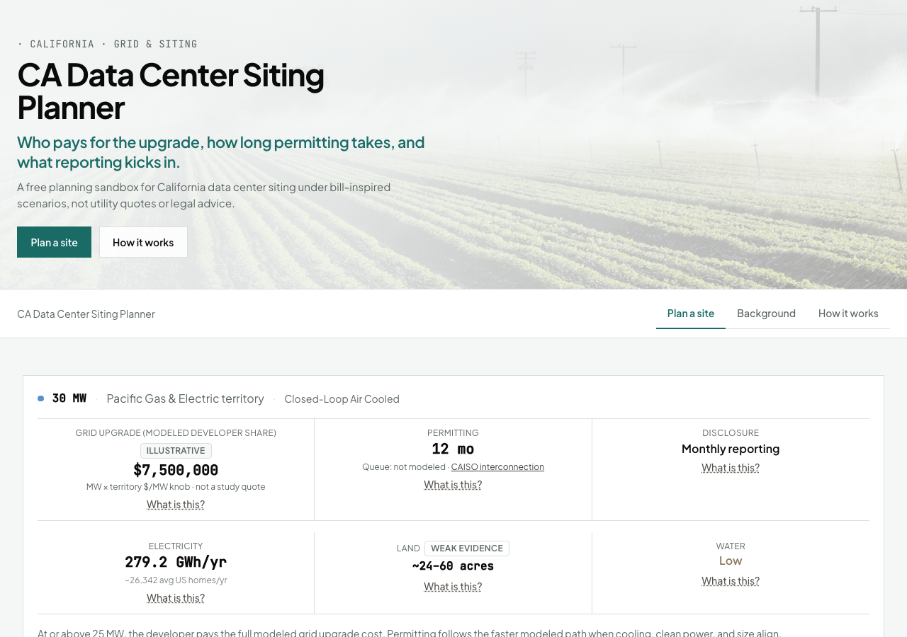

# California Data Center Siting Planner

**Live demo:** [https://saraxlinnea.github.io/ca-grid-simulator/](https://saraxlinnea.github.io/ca-grid-simulator/)

A free planning tool for California data center siting: compare illustrative grid cost splits, CEQA timeline guesses, and disclosure thresholds under bill-inspired scenarios. Numbers are placeholders, not utility quotes.



## About this project

I put this together while reading California bills about data centers and grid upgrades. Set facility size, utility territory, and cooling type, then compare outputs under three **modeled scenarios**: simplified rules based on SB 886, SB 887, and AB 1577 debates, not the statutes themselves.

**What this demonstrates:** domain modeling for energy/policy product work, evidence honesty (sourced vs speculative badges), and interactive planning UX (sticky scorecard, pin-A/live-B compare, guided 10-second demo).

**What it is not:** a TypeScript design-system or multi-app platform showcase. For FE-only interviews, treat this as one piece of a set—not the sole proof of senior FE platform engineering.

The sticky scorecard shows **modeled developer share** of placeholder grid upgrades (not an interconnection quote). Any residual is other customers of that utility—residential vs C&I class split is not modeled. Resource screens add electricity (GWh/yr), an illustrative land acres range, and a cooling-linked water High/Med/Low band.

**How it works** also separates those modeled dials from **real policy**: SB 57 (2025) and CPUC R.26-04-009 (large-load / data-center rate design), with primary links.

Not affiliated with PG&E, SCE, SDG&E, LADWP, SMUD, Silicon Valley Power, CPUC, CEC, or CAISO.

Related: for EV charging vs data-center **peak timing** on real CAISO days, see [California Net Load](https://saraxlinnea.github.io/california-net-load/).

## Architecture

Single-file React app in [`index.html`](index.html)—intentional for zero-build GitHub Pages. React, ReactDOM, Babel standalone, and Tailwind are **vendored** under [`vendor/`](vendor/) so a live review still loads if CDNs are blocked. No `npm install`, no bundler. Fonts may still load from Google Fonts when online; CSS falls back to system fonts offline.

## Disclaimer

Not legal, regulatory, or investment advice. Labels marked **Modeled estimate** are what-ifs. Check bill text and agency guidance before you rely on anything here.

## Quick start (local)

```bash
git clone https://github.com/saraxlinnea/ca-grid-simulator.git
cd ca-grid-simulator
chmod +x start.sh   # once
./start.sh
```

Open [http://localhost:8080/index.html](http://localhost:8080/index.html) in your browser.

Or without the script:

```bash
python3 -m http.server 8080
```

Hard refresh if you see a stale page: **Cmd+Shift+R** (Mac) or **Ctrl+Shift+R** (Windows/Linux).

## Shareable scenario URLs

Facility inputs sync to the query string (economics sliders are not encoded). On Plan, open **Compare scenarios** (or run the 10-second demo) to pin A vs live B. Compare state is not in the URL. Open examples:

| Scenario | URL |
|----------|-----|
| Large @ SCE | [`?preset=large`](https://saraxlinnea.github.io/ca-grid-simulator/index.html?preset=large) |
| Stress test | [`?preset=stress`](https://saraxlinnea.github.io/ca-grid-simulator/index.html?preset=stress) |
| Custom colo-scale on SCE | [`?mw=10&utility=SCE&cooling=closed&clean=1`](https://saraxlinnea.github.io/ca-grid-simulator/index.html?mw=10&utility=SCE&cooling=closed&clean=1) |
| How it works | [`?tab=how-it-works`](https://saraxlinnea.github.io/ca-grid-simulator/index.html?tab=how-it-works) |

Params: `tab` (`plan` \| `background` \| `how-it-works`), `preset` (`edge` \| `colo` \| `campus` \| `large` \| `stress`), or `mw` + `utility` (`PGE` \| `SCE` \| `SDGE` \| `LADWP` \| `SMUD` \| `SVP`) + `cooling` (`open` \| `closed` \| `liquid`) + `clean` (`0` \| `1`).

## Tabs in the app

| Tab | What it does |
|-----|----------------|
| **Plan a site** | Sticky scorecard; numbered inputs (facility type + size, utility, cooling, clean power); optional compare; guided 10-second demo |
| **Background** | Cloud market table, US electricity trends, residential vs commercial rate context |
| **How it works** | Bill scenarios, modeled vs enacted policy, worked examples, and formulas |

## Troubleshooting

| Symptom | Fix |
|---------|-----|
| `Connection refused` | Start the server first (`./start.sh`) and keep that terminal open |
| Blank page / red error banner | Hard refresh; confirm `vendor/` scripts are present (React, ReactDOM, Babel, Tailwind). Offline demos should not need unpkg. |
| Fonts look different offline | Expected: Google Fonts may fail; system font stack is the fallback |

## Project layout

```
index.html              ← the app
vendor/                 ← React, ReactDOM, Babel, Tailwind (pinned)
README.md
LICENSE
CHANGELOG.md
start.sh
docs/screenshot.png
images/                 ← section-band photos (see media/SOURCES.md)
media/                  ← map path archive + SOURCES.md
src/DEPRECATED.md       ← old scaffold, ignore
```

## Changelog

See [CHANGELOG.md](CHANGELOG.md).

## License

[MIT](LICENSE)
